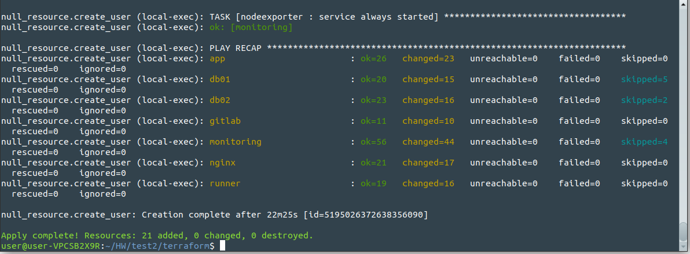

# Дипломный практикум в YandexCloud
 
---
## Этапы выполнения:

### Подготовительные действия:

1. Создан новый cloud в YandexCloud.
2. Генерируем необходимые ключи доступа в YandexCloud.
3. Создан Object S3 Storage в YandexCloud.
4. У регистратора [reg.ru](https://reg.ru) зарегистрирован домен `kuberwars.online`.
5. Домен был делегирован под управление `ns1.yandexcloud.net` и `ns2.yandexcloud.net`.
6. Предпологаем что будем использовать два workspace: `stage` и `prod`. 
7. Переменные в файлах `provider.tf` и `variables.tf` отредактированы для безопасности *****.
8. Опционально можно изменить параметры уровня [производительности машин](https://cloud.yandex.ru/docs/compute/concepts/performance-levels). 
9. Для `stage` определен уровень 50% процессорной мощности. Для `prod` полноценные 100%.

### Создание инфраструктуры

***Создаем workspace и запускаем создание нашей инфраструктуры***

```bash
$ terraform workspace new stage
$ terraform workspace new prod
$ terraform workspace select stage
$ terraform workspace list
  default
  prod
* stage
$ terraform init
$ terraform plan
$ terraform apply -auto-approve
```

***Результат после создания инфраструктуры***



После создания имеем следующее: 

**Воссозданные ВМ в YandexCloud**


**Записи DNS домена в YandexCloud**


**Главный сайт с WordPress, с автоматически сгенерированным базовым проектом**


**Мониторинг всей нашей системы:**

1. **Prometheus**


2. **Alertmanager**


3. **Grafana**


***Локальный Gitlab-CE и предустановленный Gitlab-runner***


**Импортируем тестовый CiCd проект в Gitlab**


**Создаем tag 1.0.0 по заданию и проверяем успешное выполнение pipeline**


---
***После тестирования полученной инфраструктуры, удаляем её***

```bash
$ terraform destroy -auto-approve 
```
---
#### Полезные ссылки

1. https://cloud.yandex.ru/docs/tutorials/infrastructure-management/terraform-state-storage
2. https://terraform-eap.website.yandexcloud.net/docs/providers/yandex/r/compute_instance.html
3. https://www.cyberciti.biz/faq/how-to-install-and-configure-latest-version-of-ansible-on-ubuntu-linux/
4. https://docs.ansible.com/ansible/latest/user_guide/intro_inventory.html
5. https://galaxy.ansible.com
6. https://www.8host.com/blog/poluchenie-sertifikata-lets-encrypt-s-pomoshhyu-ansible-v-ubuntu-18-04/
7. https://www.8host.com/blog/kak-rabotat-s-ansible-prostaya-i-udobnaya-shpargalka/

---