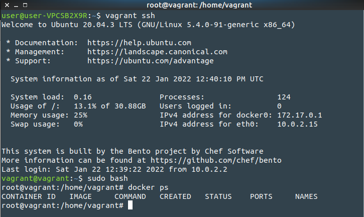

# Домашнее задание к занятию "5.2. Применение принципов IaaC в работе с виртуальными машинами"

## Задача 1

1. Опишите своими словами основные преимущества применения на практике IaaC паттернов.

### Ответ

```
1) Цена, скорость и уменьшение рисков; 
2) Уменьшение времени затрачиваемого на рутинные операции; 
3) Возможность не фокусироваться на рутине, а заниматься более важными задачами;
4) Автоматизация инфраструктуры позволяет эффективнее использовать существующие ресурсы, втоматизация позволяет минимизировать риск возникновения человеческой ошибки.
```

2. Какой из принципов IaaC является основополагающим?

### Ответ

```
Принцип CI/CD - непрерывная интеграция/непрерывная доставка.
```

## Задача 2

1. Чем Ansible выгодно отличается от других систем управление конфигурациями?  

### Ответ

```
Не большой порог вхождения, расширяемость плагинами, и что важно, не нужна установка агента на клиентские машины.
```

2. Какой, на ваш взгляд, метод работы систем конфигурации более надёжный push или pull?

### Ответ

```
Метод `push` - потому что в этом случае сервер инициирует отправку конфигурации, а не клиентская машина.
```

## Задача 3

Установить на личный компьютер:

1. VirtualBox

```bash
user@user-VPCSB2X9R:~$ vboxmanage --version

6.1.26_Ubuntur145957
```
2. Vagrant

```bash
user@user-VPCSB2X9R:~$ vagrant version

Installed Version: 2.2.6
```
3. Ansible

```bash
user@user-VPCSB2X9R:~$ ansible --version

ansible 2.9.6
  config file = /etc/ansible/ansible.cfg
  configured module search path = ['/home/user/.ansible/plugins/modules', '/usr/share/ansible/plugins/modules']
  ansible python module location = /usr/lib/python3/dist-packages/ansible
  executable location = /usr/bin/ansible
  python version = 3.8.10 (default, Nov 26 2021, 20:14:08) [GCC 9.3.0]
```

## Задача 4

Воспроизвести практическую часть лекции самостоятельно.

- Создать виртуальную машину.
- Зайти внутрь ВМ, убедиться, что Docker установлен с помощью команды
```
docker ps
```

### Вывод


